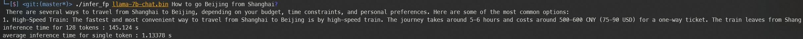
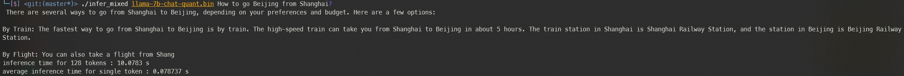

### llama2.cu

A quantized llama-7b demo. 

Some ops are replaced with int8 calculation implementation to speed up. The remaining ops are still implemented using half precision.

The selection of quantization ops lacks further experimentation, and the calibration stage only used tens of question, so the perplexity of the model cannot be guaranteed.

### Requirement

[sentencepiece](https://github.com/google/sentencepiece)

### Install
First, clone this repo.

```
git clone https://github.com/YohannXu/llama2.cu
```

Then, create a python virtual environment and install python requirements.

```
python -m venv venv
source venv/bin/activate
pip install -r requirements.txt
```

compile cuda code.

```
make
```

### Usage 

obtain llama-7b-chat weights and place them in ./weights/llama-7b-chat

```
ls ./weights/llama-7b-chat
consolidated.00.pth tokenizer.model params.json
```

#### float inference

convert pth weights to bin format.

```
python convert_weights.py --ckpt weights/llama-7b-chat/consolidated.00.pth --out llama-7b-chat.bin
```

run the inference

```
./infer_fp llama-7b-chat.bin <prompt>
```

#### quantization inference

calibrate model.

```
python calibration.py --ckpt-dir weights/llama-7b-chat
```

quantized weights and onnx will be saved in `llama-7b-chat-quant.pth` and `llama-7b-chat-quant.onnx`

convert quantized weights and onnx to bin format.

```
python convert_weights_mixed.py --ckpt llama-7b-chat-quant.pth
```

run the inference.

`./infer_mixed llama-7b-chat-quant.bin <prompt>`

### Results

experiment environment

- System: WSL2 Ubuntu 20.04.6 LTS
- Cuda version: 12.2
- Python version: 3.8.10
- GPU: RTX 2070

float inference



mixed inference



the inference speed has been boosted by 10x, but the quality of answers decrease.